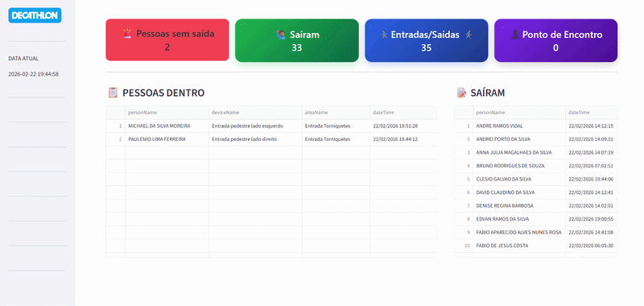

# Relatório customizado para Decathlon

### Customização de relatório solicitado para o Centro de distribuição Decathlon usando a API do Sistema de controle de acesso.

<h3>Motivação:</h3>
Durante a evacuação do Centro Logístico, torna-se essencial a identificação precisa e objetiva dos colaboradores que ainda permanecem nas dependências da empresa, garantindo que as equipes responsáveis possam direcionar o resgate de forma rápida, organizada e eficiente, reduzindo riscos e assegurando a integridade de todos os envolvidos.

## 🎥 Demonstração do Sistema

  

Este projeto foi desenvolvido com o objetivo de automatizar a extração e o tratamento de dados provenientes de uma API corporativa, transformando informações operacionais em relatório estruturado e personalizados para apoio à gestão da área de Segurança do Trabalho. A solução surgiu a partir da necessidade de reduzir processos manuais, minimizar erros e acelerar a geração de informações estratégicas que anteriormente demandavam tempo elevado de consolidação e conferência.

O sistema realiza a autenticação no endpoint da API, consome os dados disponibilizados, aplica regras de tratamento e organização conforme a necessidade do gestor responsável e entrega um relatório padronizado, confiável e pronto para análise. Todo o desenvolvimento foi realizado em PYTHON, ESTREAMLIT para apresentação de dados, PANDAS para manipulação dos dado, utilizado a bibliotecas REQUESTS para integração com API REST e JSON para estruturação das informações, VERSIONAMENTO controlado por meio do GitHub, garantindo rastreabilidade e organização do código.

A implementação proporcionou maior eficiência operacional, redução significativa do tempo de processamento das informações e aumento da confiabilidade dos dados apresentados, permitindo que a gestão tome decisões com base em informações consolidadas e precisas. Além de atender à demanda atual, o sistema foi estruturado de forma escalável, possibilitando futuras integrações e evoluções conforme novas necessidades do negócio.